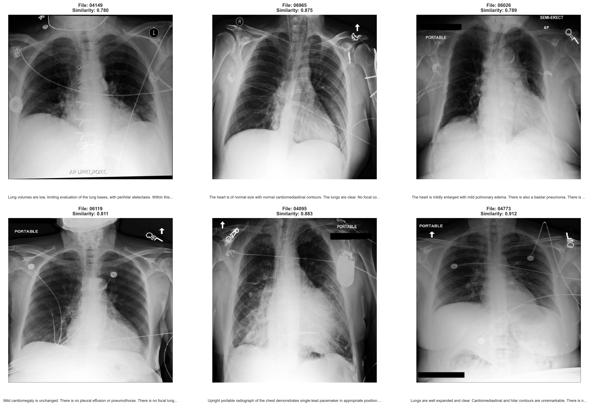
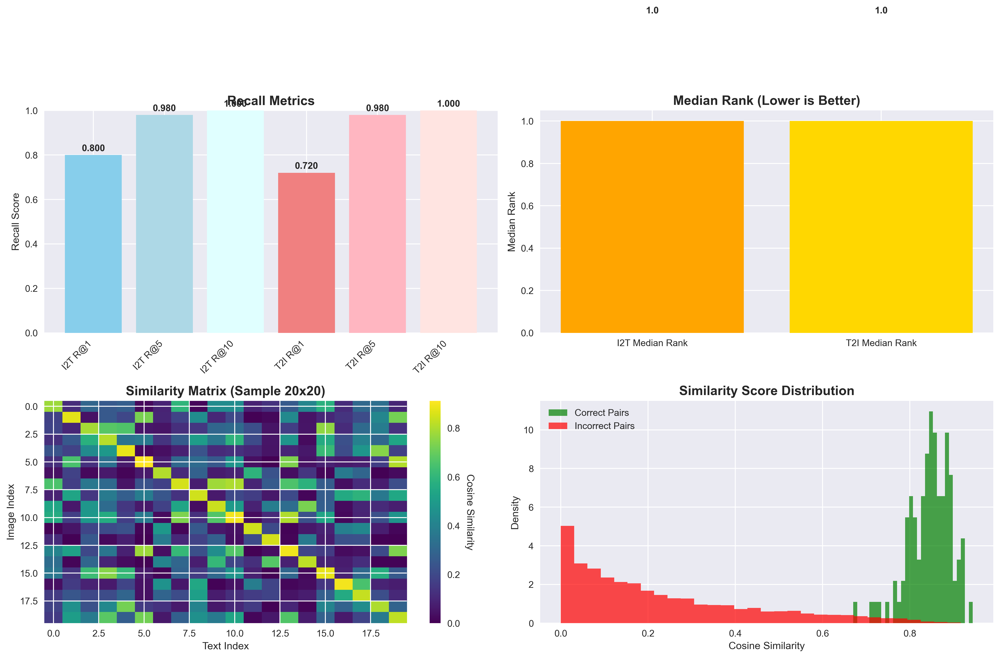

# 🧠 Vision-Language Contrastive Learning for Chest X-rays

A state-of-the-art **PyTorch-based contrastive learning framework** that bridges the gap between chest X-ray images and radiology reports. This project implements a dual-encoder architecture (ResNet-50 + DistilBERT) to learn rich, aligned representations for medical image-text pairs.

<div align="center">

[](https://python.org)
[](https://pytorch.org)
[](https://docker.com)
[](LICENSE)

</div>

---

## ✨ Key Features

🔬 **Medical AI Focus**: Specifically designed for chest X-ray and radiology report alignment  
🏗️ **Dual-Encoder Architecture**: ResNet-50 for images, DistilBERT for text  
📊 **Contrastive Learning**: Symmetric InfoNCE loss for robust representation learning  
🐳 **Docker Ready**: Complete containerization for reproducible experiments  
🚀 **Easy Deployment**: Simple APIs for training, evaluation, and inference  
📈 **Comprehensive Metrics**: Recall@K, median rank, and similarity tracking  

---

## 📊 Demo Results

<table>
<tr>
<td></td>
<td></td>
</tr>
<tr>
<td align="center"><b>🔍 Top-6 Retrieved X-rays for Input Reports</b></td>
<td align="center"><b>📈 Recall, Median Rank, and Similarity Metrics</b></td>
</tr>
</table>

---

## 🏗️ Model Architecture

Our framework employs a sophisticated dual-encoder design:

```
┌─────────────────┐    ┌─────────────────┐
│   Chest X-ray   │    │ Radiology Report│
│     Image       │    │   (Findings)    │
└─────────┬───────┘    └─────────┬───────┘
          │                      │
          ▼                      ▼
┌─────────────────┐    ┌─────────────────┐
│   ResNet-50     │    │   DistilBERT    │
│ (Vision Encoder)│    │ (Text Encoder)  │
└─────────┬───────┘    └─────────┬───────┘
          │                      │
          ▼                      ▼
┌─────────────────┐    ┌─────────────────┐
│  Projection     │    │  Projection     │
│     Head        │    │     Head        │
└─────────┬───────┘    └─────────┬───────┘
          │                      │
          └──────────┬───────────┘
                     ▼
            ┌─────────────────┐
            │ Contrastive Loss│
            │  (InfoNCE)      │
            └─────────────────┘
```

**Technical Specifications:**
- **Vision Encoder**: ResNet-50 (ImageNet pretrained)
- **Text Encoder**: DistilBERT (HuggingFace transformers)
- **Embedding Dimension**: 512D shared representation space
- **Loss Function**: Symmetric InfoNCE with temperature scaling
- **Projection Head**: Multi-layer perceptron with ReLU activation

---

## 📁 Dataset Structure

Organize your data following this simple structure:

```
project/
├── images/          # 📸 Chest X-ray images (.jpg, .png)
│   ├── patient_001.jpg
│   ├── patient_002.jpg
│   └── ...
└── reports/         # 📋 Radiology reports (.txt)
    ├── patient_001.txt
    ├── patient_002.txt
    └── ...
```

**Important Notes:**
- Each report file should contain a "Findings:" section
- Image and report files must share the same basename (e.g., `patient_001.jpg` ↔ `patient_001.txt`)
- Supported image formats: `.jpg`, `.png`, `.jpeg`

---

## 🚀 Quick Start

### 1. 📦 Installation

```bash
# Clone the repository
git clone https://github.com/yourusername/vision-language-chest-xray.git
cd vision-language-chest-xray

# Install dependencies
pip install -r requirements.txt
```

### 2. 🏃‍♂️ Training

```bash
# Start training with default configuration
python main.py

# Or with custom parameters
python main.py --batch_size 32 --learning_rate 1e-4 --epochs 100
```

**Configuration**: Update data paths in `main.py`:
```python
IMAGES_DIR = "path/to/your/images"
REPORTS_DIR = "path/to/your/reports"
```

### 3. 🔮 Inference

```python
from model import load_model
from inference import inference_example

# Load trained model
model = load_model('saved_model/best_model.pth', 'saved_model/config.json')

# Calculate similarity between image and report
similarity = inference_example(
    model, 
    "path/to/image.jpg", 
    "Findings: Clear lungs with no acute abnormalities.", 
    tokenizer
)
print(f"Similarity score: {similarity:.4f}")
```

---

## 🐳 Docker Support

Run everything in an isolated, reproducible environment:

```bash
# Build the Docker image
docker build -t chest-vl .

# Run training
docker run --rm -v $(pwd):/workspace chest-vl python main.py

# Run with GPU support
docker run --rm --gpus all -v $(pwd):/workspace chest-vl python main.py
```

---

## 📊 Evaluation Metrics

Our framework tracks comprehensive metrics:

- **Recall@K**: Retrieval accuracy at top K results
- **Median Rank**: Median position of correct matches  
- **Mean Similarity**: Average cosine similarity scores
- **Training Loss**: Contrastive loss convergence

---

## 🛠️ Advanced Usage

### Custom Configuration

```python
# Create custom training configuration
config = {
    'batch_size': 64,
    'learning_rate': 5e-5,
    'embedding_dim': 768,
    'temperature': 0.07,
    'num_epochs': 200
}
```

### Multi-GPU Training

```bash
# Use multiple GPUs with DataParallel
CUDA_VISIBLE_DEVICES=0,1,2,3 python main.py --multi_gpu
```

### Evaluation Only

```bash
# Skip training and evaluate existing model
python main.py --eval_only --model_path saved_model/best_model.pth
```

---

## 🤝 Contributing

We welcome contributions! Please see our [Contributing Guide](CONTRIBUTING.md) for details.

1. Fork the repository
2. Create your feature branch (`git checkout -b feature/amazing-feature`)
3. Commit your changes (`git commit -m 'Add amazing feature'`)
4. Push to the branch (`git push origin feature/amazing-feature`)
5. Open a Pull Request

---

## 📄 License

This project is licensed under the MIT License - see the [LICENSE](LICENSE) file for details.

---

## 🙏 Acknowledgments

- **PyTorch Team** for the excellent deep learning framework
- **HuggingFace** for transformer models and tokenizers
- **Medical imaging community** for inspiring this work
- **Research contributors** who provided valuable feedback

---


<div align="center">
<b>⭐ Star this repository if you find it helpful!</b>
</div>
